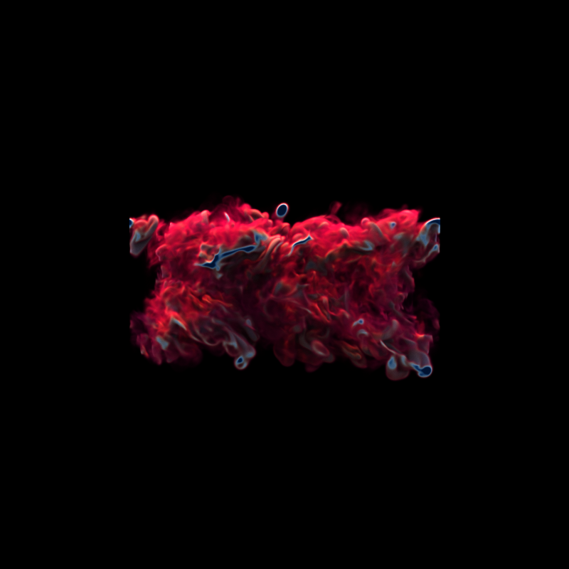

# Open Volume Renderer (OVR)

[](https://github.com/wilsonCernWq/open-volume-renderer/actions/workflows/main.yml)



## TODO List

* Cleanup repeated packages in `common/vidi3d` using cmake superbuild
* Remove Qt dependencies asked by `common/vidi3d`
* Cleanup scene file features
* embed noise file into the code
* add neural representation renderer (with API for NN and Libtorch)

## Known Bugs
* ospray renderer has wired color
* integrate light information in scene files
* wrong image when rendering ammonia datasets (looks like wrong value range)
* cannot control logging with cmd line

## Building the Code

This code contains two versions because the rendering framework was heavily factored and reimplemented 
for multiple times. The new version lies in the `src` directory with the old version in `sources`. The 
old version probably should not be used, so it is commented out intentionally. The old version is still
being kept because there are functionalities yet to be ported.

This code also contains experimental programs implemented for testing. Each directory in the `experiment`
folder contains one standalone program. They are simplied versions of the main renderer, which can be 
useful for embeded rendering implementation.

## Dependencies

- a compiler
    - on Windows, tested with Visual Studio 2017 and 2019 community editions.
    - on Linux, tested with Ubuntu 18 and Ubuntu 19 default gcc installs.
- CUDA 11.3 or above
    - Download from developer.nvidia.com.
    - on Linux, suggest to put `/usr/local/cuda/bin` into your `PATH`.
- latest NVIDIA developer driver that comes with the SDK.
    - download from http://developer.nvidia.com/optix and click "Get OptiX".
- OptiX 7 SDK
    - download from http://developer.nvidia.com/optix and click "Get OptiX".
    - on linux, suggest to set the environment variable `OptiX_INSTALL_DIR` to wherever you installed the SDK.  
    `export OptiX_INSTALL_DIR=<wherever you installed OptiX 7.0 SDK>`
    - on windows, the installer should automatically put it into the right directory/
- OSPRay & TBB
  - if you are building this code in `Release` mode, simply download the latest OSPRay 
    from https://github.com/ospray/ospray/releases and TBB from https://github.com/oneapi-src/oneTBB/releases.
  - if you are building this code in other configuration, you need to compile and install OSPRay manually. 
    You also do not need to download TBB separately because OSPRay's superbuild will provide a version of TBB. 
- LibTorch
  - you will also need libtorch for machine learning support

Detailed steps below:

## Building

- Install required packages

    - on Debian/Ubuntu: `sudo apt install libglfw3-dev cmake-curses-gui`

- Clone the code

- Create (and enter) a build directory
```
    mkdir build
    cd build
```

- Configure with cmake (Debug Mode)
    - Ubuntu: 
    ```
    cmake .. -DCMAKE_BUILD_TYPE=Debug 
    # cmake .. \
    #     -DCMAKE_BUILD_TYPE=Debug \
    #     -DCMAKE_PREFIX_PATH=<path-to-libtorch> \
    #     -Dospray_DIR=<path-to-ospray>\lib\cmake\ospray-x.x.0 \
    #     -DTBB_DIR=<path-to-tbb>\lib\cmake\tbb
    ```
    - Windows: 
    ```
    cmake -G "Visual Studio 16 2019" -T host=x64 -A x64 .. -DCMAKE_BUILD_TYPE=Debug
    # cmake -G "Visual Studio 16 2019" -T host=x64 -A x64 .. ^
    #     -DCMAKE_BUILD_TYPE=Debug ^
    #     -DCMAKE_PREFIX_PATH=<path-to-libtorch> ^
    #     -Dospray_DIR=<path-to-ospray>\lib\cmake\ospray-x.x.0 ^
    #     -DTBB_DIR=<path-to-tbb>\lib\cmake\tbb
    ```

- And build
```
    cmake --build .
```

## Running

- On Linux:
```
./renderapp /home/qadwu/Work/ovr/data/configs/scene_mechhand.json nncache
```
